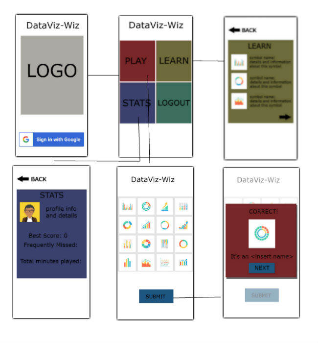
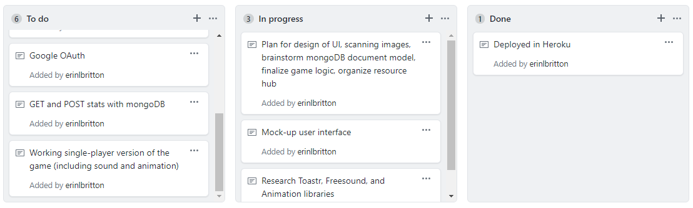

# DataViz-Wiz

[DataViz-Wiz](http://dataviz-wiz.herokuapp.com/) is a fast-paced, challenging, and educational application to improve a user's understanding of data visualization. A user is presented a collection of graphs and required to quickly identify the matching pair. 

DataViz-Wiz brings [The Graphic Continuum Match It Game](https://policyviz.com/product/the-graphic-continuum-match-it-game/) by [Severino Ribecca](https://www.datavizcatalogue.com) and [Jonathan Schwabish](https://www.policyviz.com) to your mobile device.

## Screen Layout

## Roles

Team Member | UI | Game Component | Stats Component | Learn Component | Firebase | MongoDB | Routing | Toastr | Freesound | Animation
----- | ----- | ----- | ----- | ----- | ----- | ----- | ----- | ----- | ----- | -----
Dominique | X | X | X | | X | | X | | | X
Pete | X | X | | X | | X | | X | X | X
Erin | X | | X | X | | X | X | | X | X

## Project Management Board

### Week 1 – Plan, Design, and Research (06/23/18) 
- [ ] Research Toastr, Freesound, and Animation libraries
- [ ] Mock-up user interface
- [ ] Plan for design of UI
- [x] Scan images
- [ ] Brainstorm mongoDB document model
- [ ] Finalize game logic

### Week 2 – Ready MVP (Working App!), Mini-Presentation (06/30/18)
- [ ] Working single-player version of the game
- [ ] GET and POST stats with mongoDB
- [ ] Google OAuth
- [x] Deployed in Heroku
- [ ] Organized resource hub

### Week 3 – Project Polish, Functionality Push, Final Plan (07/09/18)
- [ ] Add sound and animation
- [ ] Working react side panel to organize pages
- [ ] Working two-player version of the game (Firebase)
